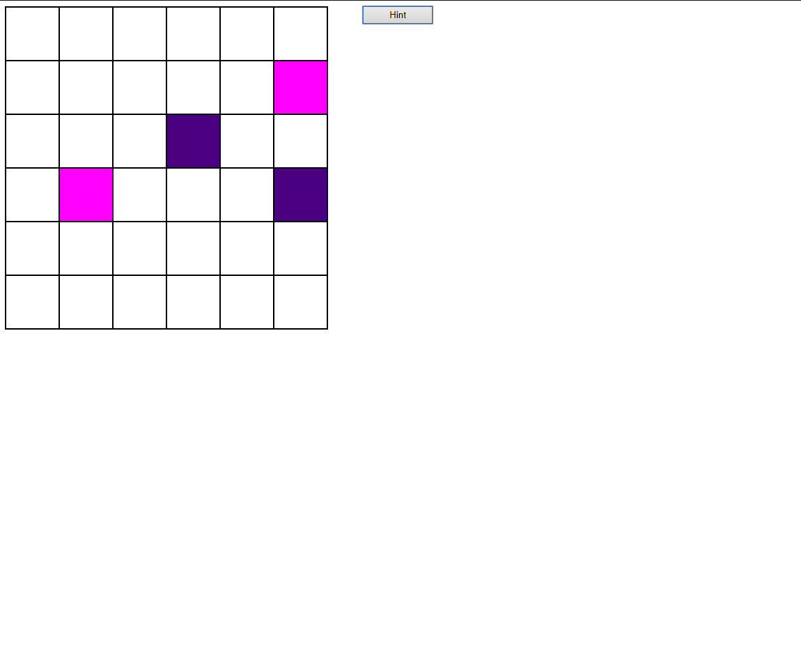
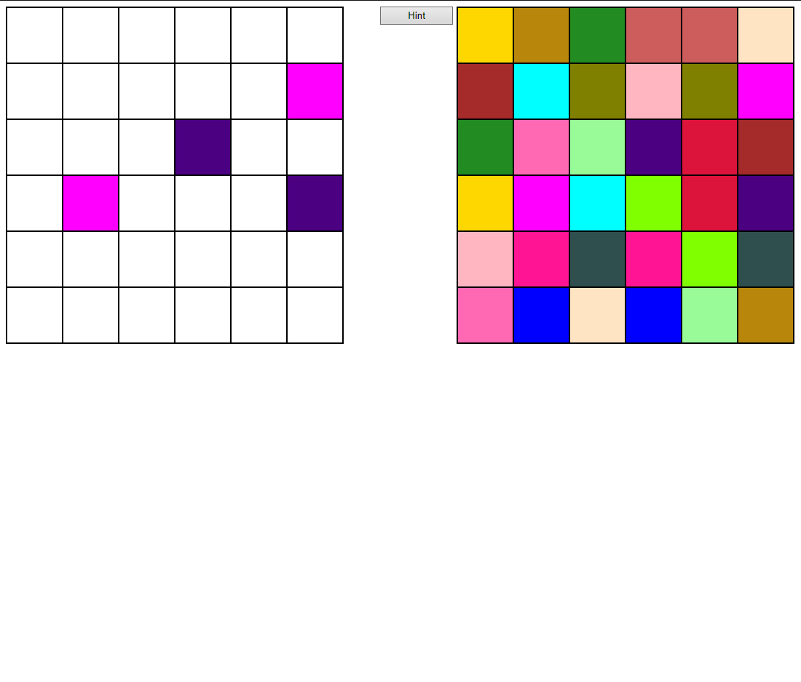

<!-- BODY -->
# JavaScript Color Memory Game

<!-- PROJECT IMAGES -->
## Project Images

### Project Image - 1


### Project Image - 2


### Project Image - 3


<br/>

<!-- ABOUT THE PROJECT -->
## About The Project
I developed this project to improve myself in the JavaScript and to learn the Jquery library. When the user enters the appropriate number, the program automatically adjusts the grid scheme and assigns random color pairs to the squares. The user is trying to find the two same colors assigned to the boxes on this page, if two different colors are opened, the opened boxes are closed again, if the two boxes are the same color, the boxes remain open in their own color. The user can see the locations of the colors by clicking on the hint button.

<br/>

<!-- Technologies Used -->
## Technologies Used

This project is developed with the followings:

* [JavaScript](https://www.javascript.com)
* [JQuery](https://jquery.com)
* HTML
* CSS

<br/>

<!-- Setup/Installation -->
## Setup/Installation
 Clone the repository 
   ```sh
   git clone https://github.com/dyakupoglu/JavaScript-Color-Memory-Game.git
   ```

<br/>

<!-- LICENSE -->
## License

Distributed under the MIT License. See `LICENSE.txt` for more information.
